# Examples

## Example 1. Ethyl Benzene Process: Recycle Column

In the Ethyl Benzene (EB) process there is a stage to separate Benzene (B) from the product stream using a distillation column. The flow of distillate (D stream) and bottom product (B stream) are manipulated variables to control the condenser and the sump levels. The pressure of the column is controlled by manipulating the heat duty of the condenser. The temperature of the 14th stage (starting from the top) affects the product quality. This variable is controlled by manipulating the reboiler heat duty.

<figure class="image" align="center">
   
   <figcaption>Figure 1. Distillation Column</figcaption>
</figure>

The process information is shown in Table 1.

<table>
<tr>
<td colspan=1>
     Table 1. Process informations
</td>

|Property     |Description|Unit    |Stream F|Stream D|Stream B|
|-------------|:----------|:------:|:------:|:------:|:------:|
|Mole fraction|E          |%       |0.0001  |0.0001  |-       |
|             |B          |%       |0.5146  |0.9989  |0.0003  |
|             |EB         |%       |0.3354  |0.0010  |0.6905  |
|             |DEB        |%       |0.1500  |-       |0.3092  |
|Temperature  |           |K       |432     |314     |390     |
|Pressure     |           |atm     |0.39    |0.3     |0.5     |
|Volume flow  |           |m3/hr   |250     |88.5    |135.5   |

</tr>

Insights:

- The distillate and the bottom product are highly inversely correlated with the reflux drum level and the sump level signals.

- The condenser and reboiler duties have a strong positive correlation with the stage 1 pressure and stage 20 temperature signals.

- The level has a ramp response while the temperature and pressure have first-order responses.

We assume reflux drum level, sump level, Stage 1 pressure and last stage temperature as Controlled variables (CV) and the distillate flow, bottom product flow, condenser duty and reboiler duty as manipulated variables (MV).
In the following sections, the distillation column is identified using different available models in SysID Add-on.

### ARX Model

  

    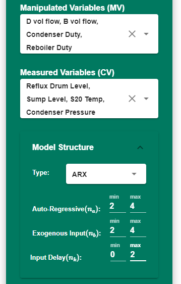</a>
  

   

   
   
 

1. Select MVs and CVs from the left panel.

   - Manipulated variables:
     - Distillate flow
     - Bottom product flow
     - Condenser duty
     - Reboiler duty

   - Controlled variables:
     - Reflux drum level
     - Sump level
     - Stage 1 pressure
     - Stage 20 temperature

2. Select minimum and maximum range for the model order and the input delay.

3. Select training and validation conditions.

4. Click on 'Identify' to start the identification process. The hyperparameter optimizer obtains the best model order and delays to minimize the prediction error.

5. Click on "Push Model" to push the Seeq Formula to the Seeq Workbench.

To avoid overfitting and capturing the noise of the signals, select lower maximum order for the ARX model.

<figure class="image" align="center">
   <a href="../_static/figuretable_arx.png">
   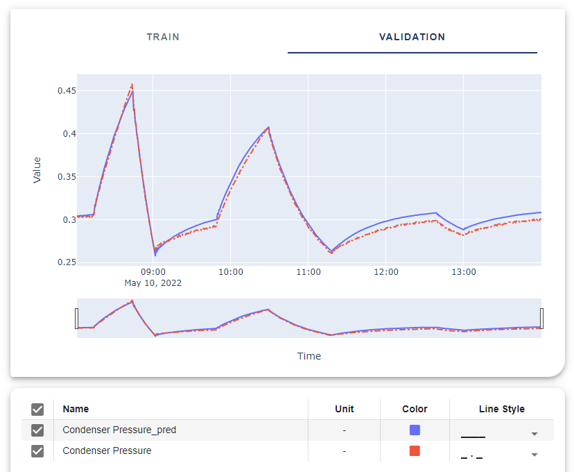</a>
   <figcaption>Figure 2. ARX result: Condenser Pressure</figcaption>
</figure>

### Sub Space Model

  

    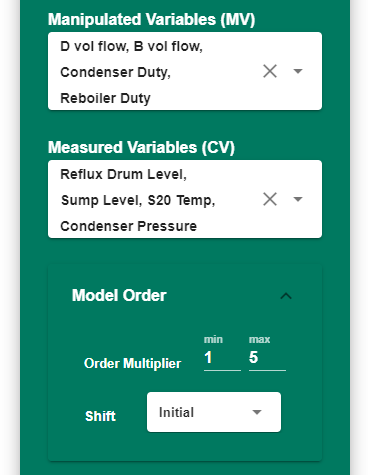</a>
  

   

   
   

1. Select MVs and CVs from the left panel.

   - Manipulated variables:
     - Distillate flow
     - Bottom product flow
     - Condenser duty
     - Reboiler duty

   - Controlled variables:
     - Reflux drum level
     - Sump level
     - Stage 1 pressure
     - Stage 20 temperature

2. Select minimum and maximum range for the order multiplier. A lower multiplier leads to lower-order models.

3. Select shift method.

4. Select training and validation conditions.

5. Click on 'Identify' to start the identification process.

6. Click on "Push Model" to push the predicted data to the Seeq Workbench.

<figure class="image" align="center">
   <a href="../_static/figuretable_ss.png">
   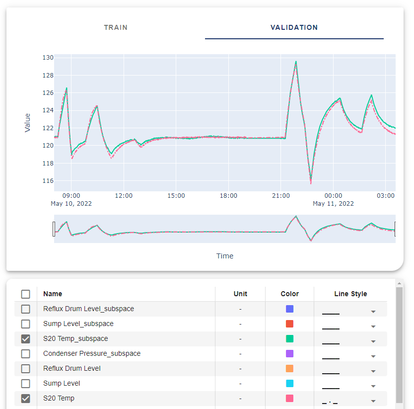</a>
   <figcaption>Figure 3. SubSpace results: Stage 20 Temperature</figcaption>
</figure>

### Neural Network Model

1. Select MVs and CVs from the left panel.

  

    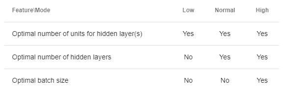</a>
  

   

   
   

   - Manipulated variables:
     - Distillate flow
     - Bottom product flow
     - Condenser duty
     - Reboiler duty

   - Controlled variables:
     - Reflux drum level
     - Sump level
     - Stage 1 pressure
     - Stage 20 temperature

  

    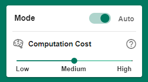</a>
  

   

   
   

2. Select the computation mode.

3. Select training and validation conditions.

4. Click on 'Identify' to start the identification process.

5. Click on "Push Model" to push the predicted data to the Seeq Workbench.

<figure class="image" align="center">
   <a href="../_static/figuretable_arx.png">
   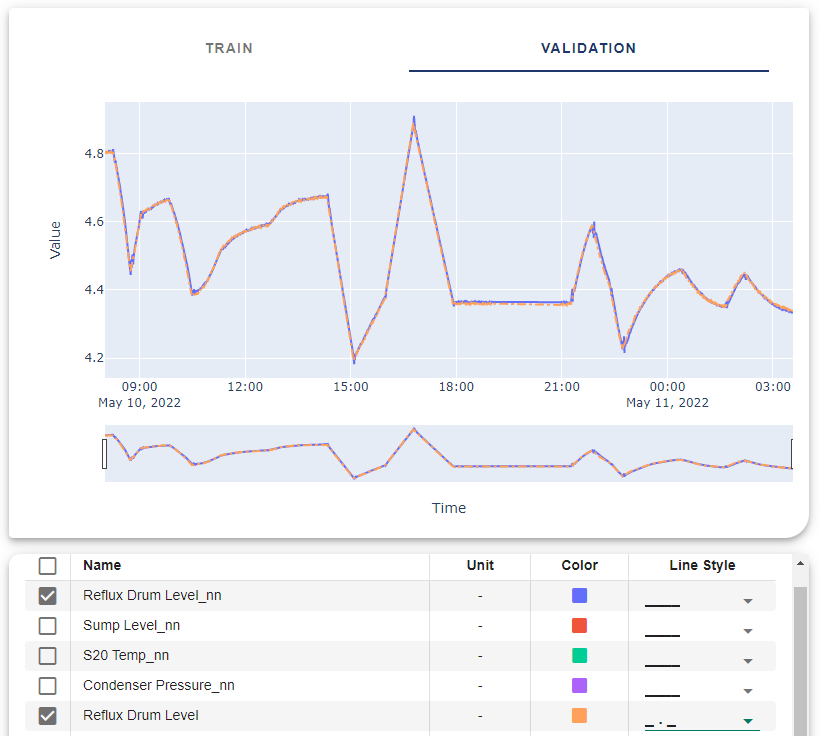</a>
   <figcaption>Figure 4. Neural Network results: Reflux Drum Level</figcaption>
</figure>

### Transfer Function Model

<video width="100%" height="100%" controls>
  <source src="https://raw.githubusercontent.com/BYU-PRISM/Seeq/a587646abcbbf23d3be6ec2b148007ae32937c27/docs_src/source/_static/videos/Tf%20Ex1.mp4" type="video/mp4">
Your browser does not support the video tag.
</video>

This model requieres more knowledge about the system identification and data selection. Otherwise it will end up with no solution for the problem or the identification process takes more time to run.

<figure class="image" align="center">
   <a href="../_static/tf_note.png">
   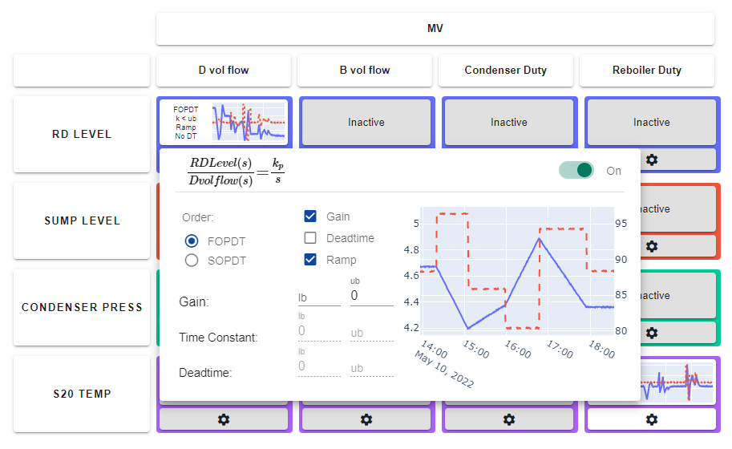</a>
   <figcaption>Figure 5. Ramp response of Reflux Drum Level</figcaption>
</figure>

1. Select MVs and CVs in the setup page.

   - Manipulated variables:
     - Distillate flow
     - Bottom product flow
     - Condenser duty
     - Reboiler duty

   - Controlled variables:
     - Reflux drum level
     - Sump level
     - Stage 1 pressure
     - Stage 20 temperature

2. Select training and validation condition. (Optional) This setting can be set and override in the Matrix page by clicking on the CV buttons. Click on 'Next' button.

<figure class="image" align="center">
   <a href="../_static/tf_setup_col.png">
   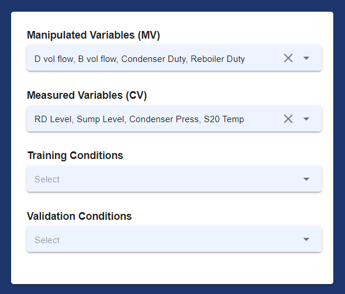</a>
   <figcaption>Figure 6. Transfer function identification: Setup page</figcaption>
</figure>

3. Modify the identification matrix. Inactive unnecessary terms by right-clicking on them or switching them off in the setting menu.

4. Select the model structure based on the system behavior.
   
5. Enter lower bounds and upper bounds for each available term in the equation. (Optional)

6. Modify and override training and validation conditions by clicking on the CV labels.

<figure class="image" align="center">
   <a href="../_static/tf_matrix_conditions.png">
   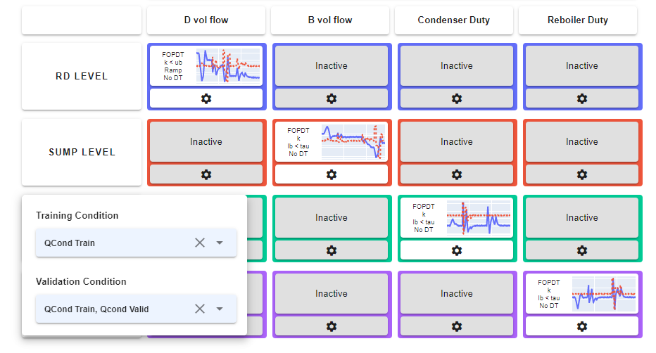</a>
   <figcaption>Figure 7. Transfer function identification: selecting training and validation conditions</figcaption>
</figure>

7. Click on 'Next' button to start the identificaiton process. Step response will be shown up after this process.

<figure class="image" align="center">
   <a href="../_static/tf_matrix_step.png">
   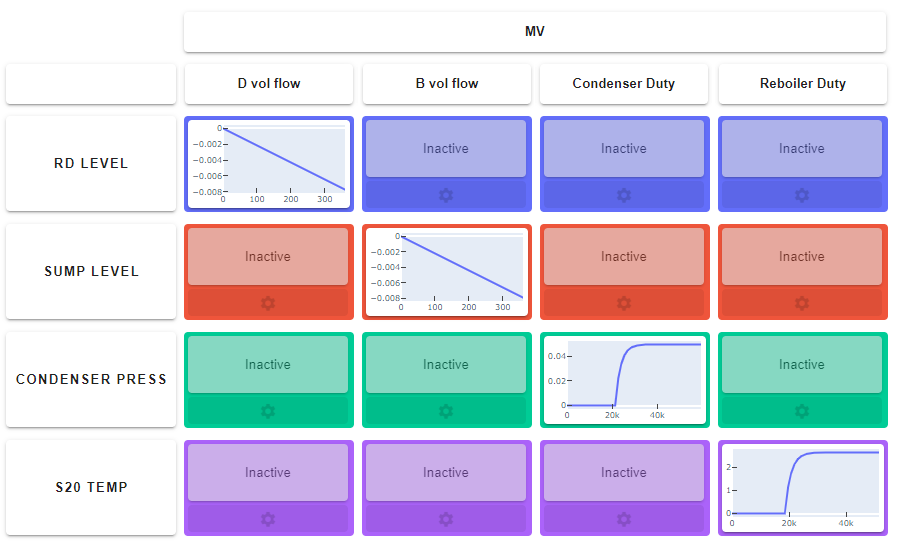</a>
   <figcaption>Figure 8. Transfer function identification: step response</figcaption>
</figure>

<figure class="image" align="center">
   <a href="../_static/tf_matrix_info.png">
   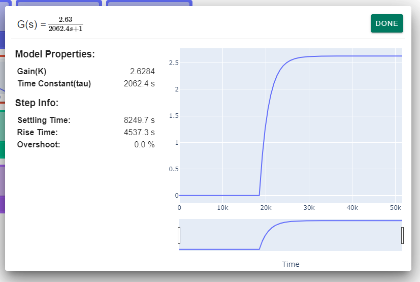</a>
   <figcaption>Figure 9. Transfer function identification: model information</figcaption>
</figure>

8. To plot training and validation results click on 'Next' button.

<figure class="image" align="center">
   <a href="../_static/tf_vis_col.png">
   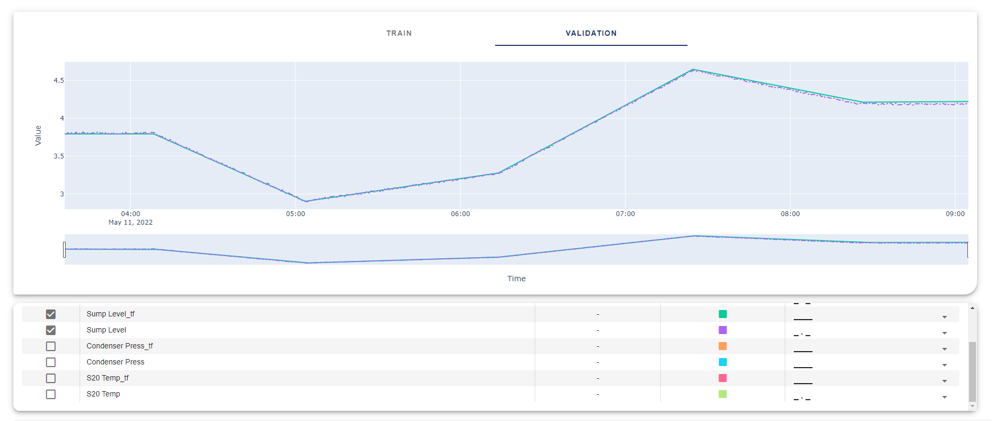</a>
   <figcaption>Figure 10. Transfer function identification: visualization</figcaption>
</figure>

9. Click on "Push Model" to push the predicted data to the Seeq Workbench.

## Example 2. Two Series Reactors

In this example an exothermic reaction occurs in two series reactors. Component A is the limiting reagent. The reaction conversion rate is calculated based on the concentration of component A . The temperatures of both reactors  are controlled by manipulating the cooling water flow rate.

 

<figure class="image" align="center">
   <a href="../_static/S_Reactors.png">
   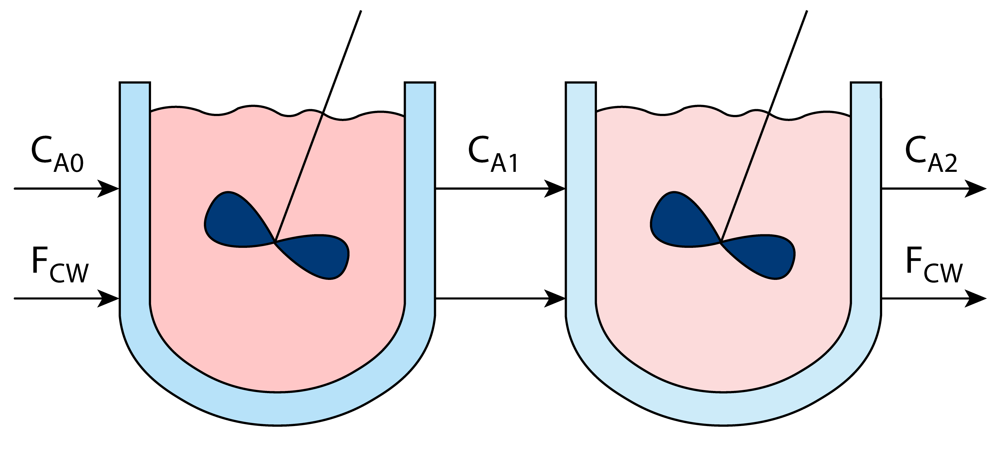</a>
   <figcaption>Figure 11. Two series reactors</figcaption>
</figure>

Insights:

- The reactor's temperatures are highly inversely correlated with the cooling water flow rate signal.

- The concentrations of component A have a strong positive correlation with the cooling water flow rate signal.

### ARX Model

<video width="100%" height="100%" controls>
  <source src="https://raw.githubusercontent.com/BYU-PRISM/Seeq/a587646abcbbf23d3be6ec2b148007ae32937c27/docs_src/source/_static/videos/Arx%20Ex2.mp4" type="video/mp4">
Your browser does not support the video tag.
</video>

  

    <a href="../_static/leftpanel_arx_ex2.png">
    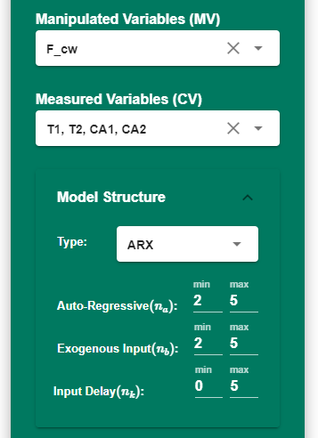</a>
  

   

   
   
 

1. Select MVs and CVs from the left panel.

   - Manipulated variables:
     - Cooling water flow rate

   - Controlled variables:
     - The reactor 1 Temperature
     - The reactor 2 Temperature
     - The concentration of component A in the reactor 1
     - The concentration of component A in the reactor 2

2. Select minimum and maximum range for the model order and the input delay.

3. Select training and validation conditions.

4. Click on 'Identify' to start the identification process. The hyperparameter optimizer obtains the best model order and delays to minimize the prediction error.

5. Click on "Push Model" to push the Seeq Formula to the Seeq Workbench.

<figure class="image" align="center">
   <a href="../_static/figuretable_arx_ex2.png">
   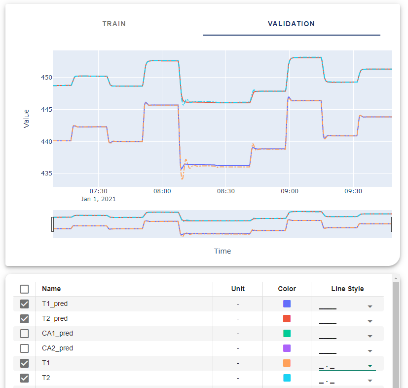</a>
   <figcaption>Figure 12. ARX result: Example 2</figcaption>
</figure>

### Sub Space Model

<video width="100%" height="100%" controls>
  <source src="https://raw.githubusercontent.com/BYU-PRISM/Seeq/a587646abcbbf23d3be6ec2b148007ae32937c27/docs_src/source/_static/videos/Ss%20Ex2.mp4" type="video/mp4">
Your browser does not support the video tag.
</video>

  

    <a href="../_static/leftpanel_ss_ex2.png">
    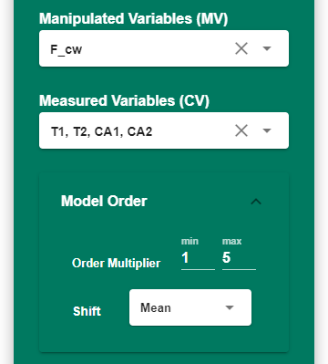</a>
  

   

   
   

1. Select MVs and CVs from the left panel.

   - Manipulated variables:
     - Cooling water flow rate

   - Controlled variables:
     - The reactor 1 Temperature
     - The reactor 2 Temperature
     - The concentration of component A in the reactor 1
     - The concentration of component A in the reactor 2

2. Select minimum and maximum range for the order multiplier. A lower multiplier leads to lower-order models.

3. Select shift method.

4. Select training and validation conditions.

5. Click on 'Identify' to start the identification process.

6. Click on "Push Model" to push the predicted data to the Seeq Workbench.

<figure class="image" align="center">
   <a href="../_static/figuretable_ss_ex2.png">
   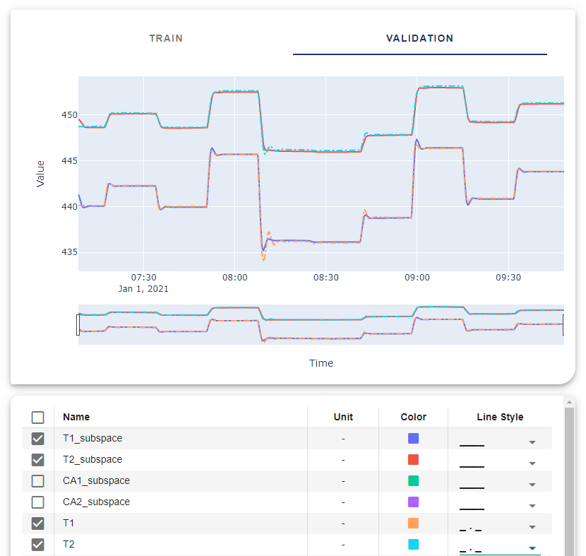</a>
   <figcaption>Figure 13. SubSpace results: Example 2</figcaption>
</figure>

### Neural Network Model

<video width="100%" height="100%" controls>
  <source src="https://raw.githubusercontent.com/BYU-PRISM/Seeq/a587646abcbbf23d3be6ec2b148007ae32937c27/docs_src/source/_static/videos/Nn%20Ex2.mp4" type="video/mp4">
Your browser does not support the video tag.
</video>

  

    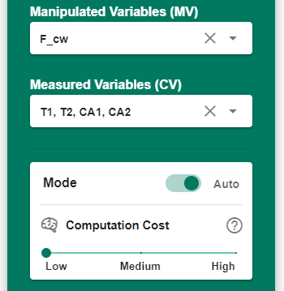</a>
  

   

   
   

1. Select MVs and CVs from the left panel.

   - Manipulated variables:
     - Cooling water flow rate

   - Controlled variables:
     - The reactor 1 Temperature
     - The reactor 2 Temperature
     - The concentration of component A in the reactor 1
     - The concentration of component A in the reactor 2

2. Select the computation mode.

3. Select training and validation conditions.

4. Click on 'Identify' to start the identification process.

5. Click on "Push Model" to push the predicted data to the Seeq Workbench.

<figure class="image" align="center">
   <a href="../_static/figuretable_nn_ex2.png">
   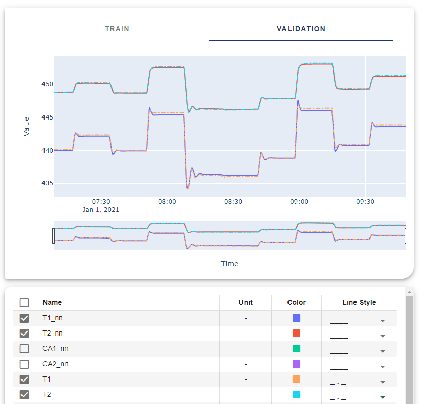</a>
   <figcaption>Figure 14. Neural Network results: Example 2</figcaption>
</figure>

### Transfer Function Model

This model requires more knowledge about system identification and data selection. Otherwise, it will end up with no solution for the problem or the identification process takes more time to run.

1. Select MVs and CVs on the setup page.

   - Manipulated variables:
     - Cooling water flow rate

   - Controlled variables:
     - The reactor 1 Temperature
     - The reactor 2 Temperature
     - The concentration of component A in the reactor 1
     - The concentration of component A in the reactor 2

2. Select training and validation condition. (Optional) This setting can be set and override in the Matrix page by clicking on the CV buttons. Click on 'Next' button.

<figure class="image" align="center">
   <a href="../_static/tf_setup_ex2.png">
   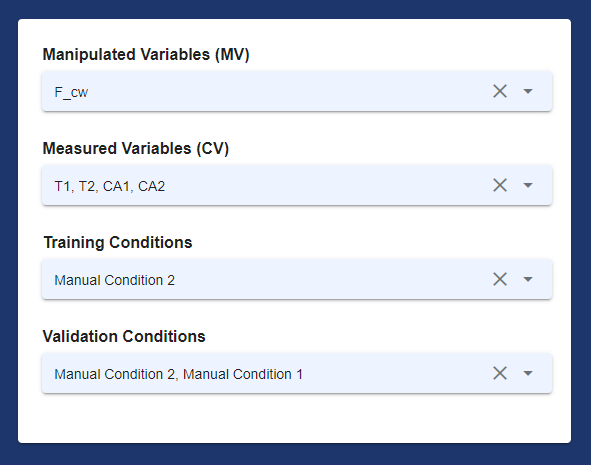</a>
   <figcaption>Figure 15. Transfer function identification: Setup page</figcaption>
</figure>

3. Modify the identification matrix. Inactive unnecessary terms by right-clicking on them or switching them off in the setting menu.

4. Select the model structure based on the system behavior.
   
5. Enter lower bounds and upper bounds for each available term in the equation. (Optional)

<figure class="image" align="center">
   <a href="../_static/tf_matrix_ex2.png">
   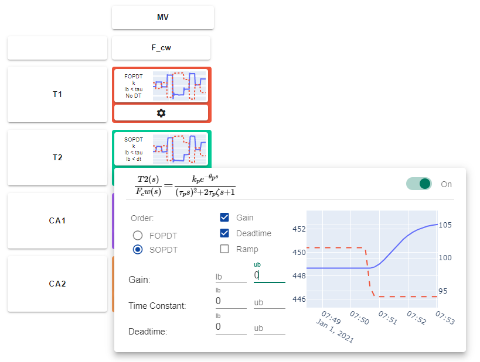</a>
   <figcaption>Figure 16. Transfer function identification: selecting training and validation conditions</figcaption>
</figure>

6. Click on 'Next' button to start the identificaiton process. Step response will be shown up after this process.

<figure class="image" align="center">
   <a href="../_static/tf_matrix_step_ex2.png">
   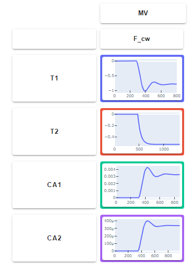</a>
   <figcaption>Figure 17. Transfer function identification: step response</figcaption>
</figure>

<figure class="image" align="center">
   <a href="../_static/tf_matrix_info_ex2.png">
   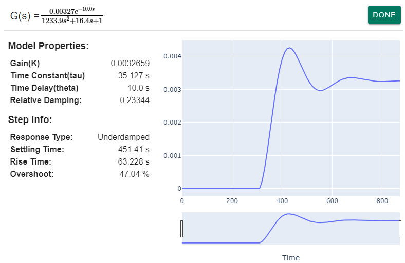</a>
   <figcaption>Figure 18. Transfer function identification: model information</figcaption>
</figure>

7. To plot training and validation results click on 'Next' button.

<figure class="image" align="center">
   
   <figcaption>Figure 10. Transfer function identification: visualization</figcaption>
</figure>

8. Click on "Push Model" to push the predicted data to the Seeq Workbench.