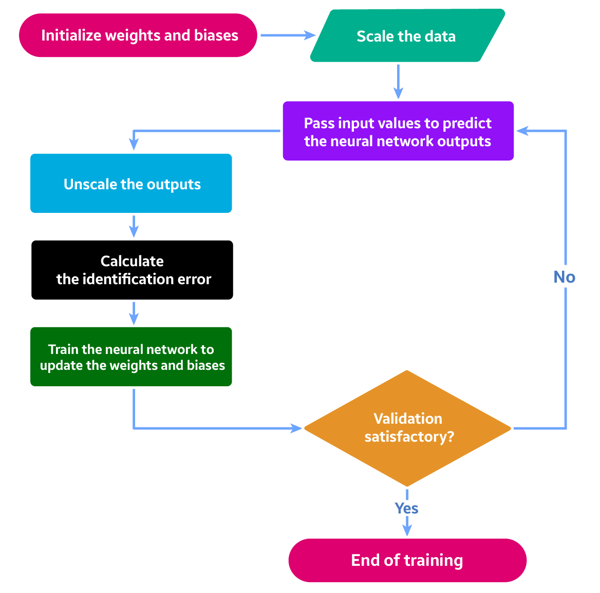

# System Identification

System Identification is a set of methods to build a mathematical model based on the system’s input/output data.
\
One of the common techniques in identifying Time-Series is data-driven modeling. In this approach, The goal is to identify a reduced model that indicates mathematical relations between data without going into details. Different models can be used based on:

- System complexity

- Amount of available data

- Model application

- Quality of the data

The following sections will describe some of the well-known models in this field.

## ARX model

ARX model is a system identification model that uses the linear correlation between previous and future values. ARX model consists of previous output terms (y) and previous input (u) terms multiplied by the linear coefficients (a, b). The linear combination of past input and output value computes the one-step-ahead prediction of output value(yk+1).
Multiple iterations of the one-step-ahead prediction return the multi-step prediction (from yk+1 to yk+n). The time window of the past input and output terms is shifted toward next segment for every iteration for multi-step prediction.
Here is an example formular with  and  for the single input and single output system,

<!-- 

 -->

: Auto-Regressive with eXogenous input
("Auto" indicates the past 'y' values, and "Exogenous" indicates the past 'u' values serving as model inputs)  
: ARX coefficient for the past output value  
: ARX coefficient for the past input value  
: Number of terms for the past output value  
: Number of terms for the past input value  
: Delay between input and output  
: present time step  

Here is another example formular with **delay**  ,  

Although the ARX model can be more detailed by increasing the number of terms , it could result in an overfit. Thus, it could be an essential step to compare the training and validation set, ensuring the prediction for the validation set is as good as the training set. The model fitting can be quantified using different statistical methods such as **MSE** (Mean Squared Error) or **SSE** (Sum of Squared Error). [Read more](https://apmonitor.com/wiki/index.php/Apps/ARXTimeSeries) about ARX models.

## State Space model

The [**State Space**](https://apmonitor.com/pdc/index.php/Main/StateSpaceModel) model is one of the linear representations of dynamic systems. Converting a model to a State Space structure is routine for process control and optimization applications. These models can be used for both continuous and discrete forms.

<table border="0" align="center">

 <tr>
    <td>Figure 2. Continuous State Space model structure.</td>
 </tr>
</table>
 

Which  is the array of states,  is the array of inputs, and  is the array of outputs.  is the transition matrix,  is the input matrix,  is the output matrix, and  is the direct transition matrix or feedthrough matrix.
Considering **n** states, **m** inputs, and **p** outputs:

<table border="0" align="center">

</table>

that  indicates set of real numbers. [Read more](http://apmonitor.com/wiki/index.php/Apps/LinearStateSpace) about State Space models.

## Transfer Function

Transfer functions are the linearized representations of dynamic systems. The first step to create a transfer function is to calculate the Laplace transform of a differential equation. After applying Laplace transform differential equation converts to an algebraic equation. These algebraic equations can be transformed back into the time domain.

In the industry, transfer functions are base of many prediction and control tuning applications. 
For the sake of simplicity first, order and second-order transfer functions are more common than others:

### First Order Plus Deadtime (FOPDT)

The first order plus deadtime is the simplest form of the transfer function. The structure and unit step response of a FOPDT has shown below. in this equation  is the process time constant,  is the process gain,  is the process deadtime,  is the process output and  is the process input.

 

<figure class="image" align="center">
   
   

   <figcaption>Figure 1. FOPDT step response</figcaption>
</figure>

### Second Order Plus Deadtime (SOPDT)
The step response of SOPDT is usually S-shaped. In the SOPDT equation  is the relative damping factor. Overshoot, Settling time and Rise time are other characterestics of SOPDT step response.

 

<figure class="image" align="center">

   

   <figcaption>Figure 2. SOPDT step response</figcaption>
</figure>

## Neural Network model

Neural networks are a set of neurons contacting each other using corresponding weight coefficients. There are many kinds of neural networks, according to their application. Multilayer Perceptron is commonly used for control applications because of its simplicity and fast response. This neural network is made up of three sections: the input layer, the hidden layer(s), and the output layer. An input layer, where the input data comes in. It is conventional to normalize data before calculations to avoid neuron saturation. Neuron saturation is a state that which a neuron gives a constant value for each entering data. The output layer receives the output data and denormalizes the results. The layers between the input layer and the output layer call the hidden layer(s) where. The number of these layers and their neurons can vary depending on the complexity of the system. Increasing hidden layers and neurons require more data and time to train the network.

<figure class="image" align="center">
   
   <figcaption>Figure 3. A simple neural network with one hidden layer</figcaption>
</figure>

Inputs of the network are input(s), delayed input(s), output(s), and delayed output(s) of the system. The number of delays given to the inputs and outputs of the system depends on its complexity. After specifying the network’s structure (number of hidden layers, number of neurons in each layer, inputs, and output of the network), weights and biases will be initialized randomly. Normalized data will be passed through the network, identification error will be calculated, the error backpropagates through the network, and weights and biases will be updated till the Mean of Square Error (MSE) meats the specified criteria then the training procedure will be terminated. Now the network is ready to mimic the system’s behavior and can be used as a model which correlates the input(s) and output(s) of the system.

<figure class="image" align="center">
   
   

   <figcaption>Figure 4. Neural network identification flowchart</figcaption>
</figure>